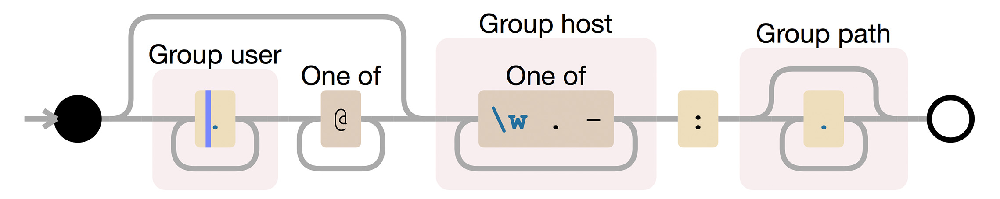

## Fustigit: gorram Git addresses

<dl>
    <dt>Fustigate &#8212; (verb) fus&middot;ti&middot;gate </dd>
    <dd>To beat with a club; cudgel.</dd>
    <dd>To criticize harshly.</dd>
</dl>


### TL;DR

Fustigit will let you "parse" SCP-like address triplets using Ruby's baked-in [URI library](https://ruby-doc.org/stdlib-2.5.7/libdoc/uri/rdoc/index.html) (... and just a *moderate* amount of monkey-patching) and turn them into probably-valid URI objects.

### What's a Triplet?

<a href="https://www.debuggex.com/r/NtHqyDI9LUz-UMia"></a>

A triplet is a format for specifying a remote resource, much like a URI. It looks like this:

    # The username is optional but the hostname and pathname are not
    <username>@<hostname>:<pathname>

Triplets predate the [original ratification of the URI RFC](https://tools.ietf.org/html/rfc2396), and are *tricksy* to parse if you're playing by URI rules since they don't define a protocol and they use a colon to separate the hostname from the pathname. `scp` and `git` are the two most common tools that still use triplets.

### Why would I need to parse triplets?

The answer is usually "[Git](https://git-scm.com)" (but sometimes it's `scp`). Git supports a conveniently inconvenient number of formats for expressing where a remote repository is located and/or what protocol should be used to connect to it. Some of them are perfectly valid URIs. Some of them are not. It's the ones that are not that may be a problem.

```yaml
---
# These won't parse and they're both SUPER common
- example.com:path/to/repo.git
- git@example.com:user/project.git

# But these will parse, which is great since they're also SUPER common
- https://example.com/user/project.git
- http://example.com/user/project.git
```

Enter Fustigit.

### How (do I use this)?

<s>Carelessly</s> Without a care in the world!

```ruby
>> URI.parse "git@github.com:mckern/fustigit.git"
URI::InvalidURIError: bad URI(is not URI?): git@github.com:mckern/fustigit.git [/some/path/for/ruby/lib/ruby/2.1.0/uri/common.rb:176:in `split']
>> require 'fustigit'
=> true
>> uri = URI.parse "git@github.com:mckern/fustigit.git"
=> #<URI::SSH:0x007f8459131f98 URL:git@github.com:mckern/fustigit.git>
>> uri.host
=> "github.com"
>> uri.user
=> "git"
>> uri.path
=> "mckern/fustigit.git"
>> uri.to_s
=> "git@github.com:mckern/fustigit.git"
>>
```

### How (does it work)?

Careful use of `Module#prepend` and `Module#extend` in `URI` and `URI::Parser`, judicious use of regular expressions, and by defining a few new `URI` subclasses: `URI::Git`, `URI::SSH`, `URI::SCP`, and `URI::RSYNC`. Some of these classes then have the `Triplet` module mixed in, which helps smooth over the conversion between a valid RFC-compliant URI and an address triplet.

### What if I'm using `Addressable::URI` instead of `::URI`?

Take a look at Martin Emde's [Gitable](https://github.com/martinemde/gitable), which extends `Addressable::URI` with additional support for Git addresses.

### Support & contribution?

In the spirit of Jordan Sissel (a hero to admins and operations people everywhere), if fustigit is not helping you parse weird Git addresses, then there is a bug in fustigit. Please open an issue or submit a pull request if something doesn't work.

### License

Fustigate is licensed under the Apache License, Version 2.0.

> "When in doubt, use brute force."
>    &#8213; <cite>Ken Thompson</cite>

### Maintainer

Ryan McKern &lt;ryan@orangefort.com&gt;
